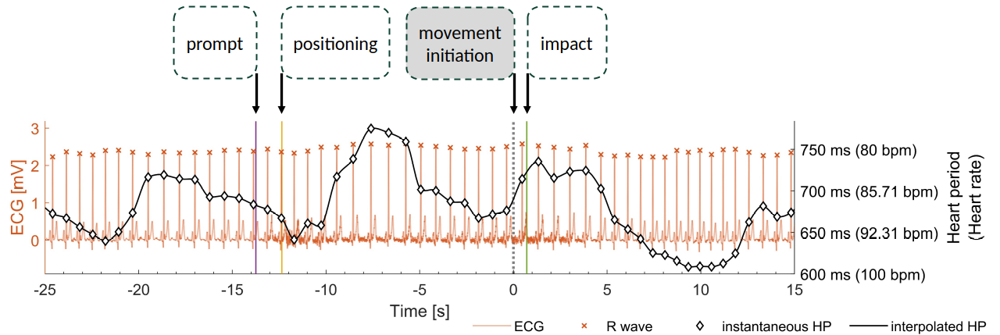
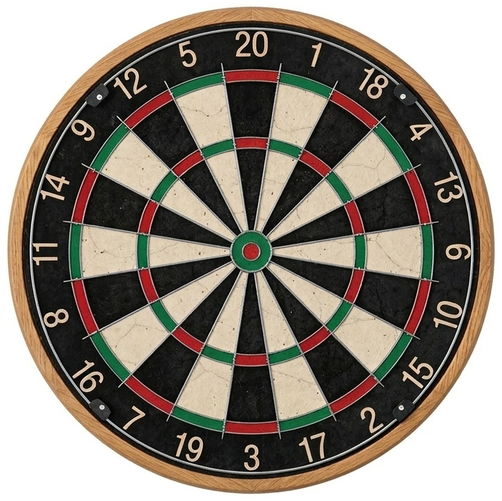

## Upcoming research projects for students at Bangor University {.nostretch .center}

::::{.columns}
:::{.column width=80%}

Dr Germano Gallicchio  

Lecturer in Psychophysiology and Cognitive Neuroscience

School of Psychology and Sport Science, Bangor University, UK  

[profile](https://www.bangor.ac.uk/staff/spss/germano-gallicchio-530785/en) | [research](https://scholar.google.com/citations?user=i3h3GbMAAAAJ&hl=en) | [software](https://github.com/GermanoGallicchio) | [learning resources](https://germanogallicchio.github.io/learning/) | [book meeting](https://outlook.office.com/book/SHESStaffTutorialandDropInHours@bangoroffice365.onmicrosoft.com/?login_hint)

 

::: {.content-visible when-format="html"}

On a computer press F11 to de/activate full-screen view.

For smartphone and review: Bottom left menu -> Tools -> PDF Export Mode.

For pdf document: use "learning resources" link above.

Last modified: 

:::

:::

:::{.column width=20%}
::: {.content-visible when-format="html"}
QR code to these slides:

:::

::: {.content-visible when-format="pdf"}
[To access the latest version of these slides or other learning material visit this link](https://germanogallicchio.github.io/learning/)
:::

 

:::
::::

# Biological clocks and movement precision {.nostretch}

Do the cardiac and breathing **clocks** influence precision in **target** sports (e.g., darts)? 

::::{.columns}
:::{.column width=75%}
{width='100%'}
:::
:::{.column width=25%}
{width='100%'}
:::
::::

In this study, you will learn to acquire and process multimodal **psychophysiological** (ECG, breathing), **kinematics** (wrist acceleration), and **behavioural** data (performance).

# (Simulated) knife throwing: the impact of cognitive load on go and no-go targets {.nostretch}

Does **cognitive load** influence the ability to **hit or avoid** targets on a spinning wheel?

In this experimental study, you will manipulate **cognitive load** as a videogame will challenge to either hit targets or avoid targets.

<iframe
width=100% 
height=40%
src="https://youtube.com/embed/o7XB4_HgBoI" 
title="Knife Hit" 
frameborder="0" 
allow="accelerometer; autoplay; clipboard-write; encrypted-media; gyroscope; picture-in-picture" 
allowfullscreen>
</iframe>

This study will use a task inspired on this videogame: [Knife Hit](https://play.google.com/store/apps/details?id=com.ketchapp.knifehit&hl=en&gl=US).

